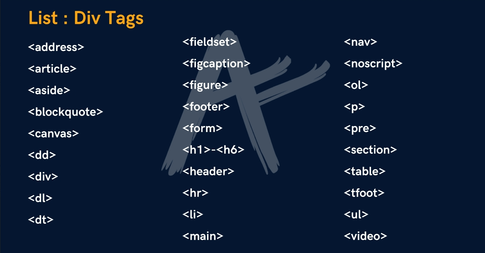
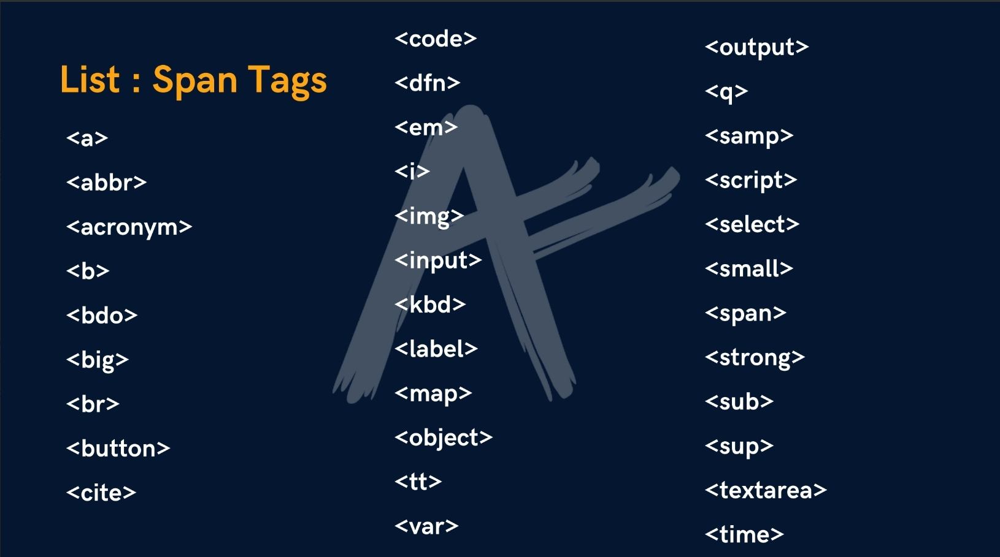

# <h1 align="center"> Page Layout Techniques

## using Semantic tags for layout

`<header>`

`<main>`

`<footer>`

### **Guide to Writing Semantic HTML [(click here)](https://cs.fyi/guide/writing-semantic-html)**

## Inside Main Tag

### Section Tag
* `<section>`     For a section on your page

### Article Tag
* `<article>`     For an article on your page

### Aside Tag
* `<aside>`       For content aside main content(ads)

## Revisiting Anchor Tag
* `<a href="https://google.com" target="_main"> Google </a>`

    * ***will open Google in new tab***

* ``

    * ***link in image***

## Div Tag

* `
` is a container used for other HTML elements

    * ***it's a Block Element (takes full width)***

### List: div tags

## span Tag

* `` is also a container used for other HTML elements,
Inline Element (takes width as per size)

### List: div tags

---